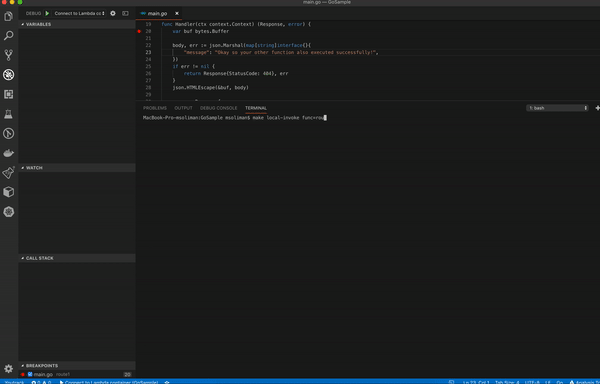

# Generator Serverless

[](https://www.npmjs.com/package/generator-sls)


[](https://github.com/msolimans/generator-sls/search?l=JSON)
[](https://www.codacy.com/app/msolimans/generator-sls?utm_source=github.com&amp;utm_medium=referral&amp;utm_content=msolimans/generator-sls&amp;utm_campaign=Badge_Grade)
[](https://gitter.im/generator-sls/community#)
[](https://app.fossa.com/projects/git%2Bgithub.com%2Fmsolimans%2FAlgorithms?ref=badge_shield)
[](http://hits.dwyl.io/msolimans/generator-sls)

Yeoman generator for a lambda Serverless project




## Requirements

*   Language of choice (Go 1.11, Python 2.7+, NodeJS 6+, .NET Core 2+, Java 8) 
*   Yeoman >= V1.8.5

## Generator installation
 
1) you are going to need [Yeoman](http://yeoman.io/):
```bash
npm install -g yo
```
2) Install the generator:

```bash
npm i -g generator-sls
```

## Usage

### Base generator

Once the link established, you can use it right away.
Create a new directory where you want your project to be and run it:

```bash
mkdir lambda-service
cd lambda-service
yo sls
```

It will prompt some questions you need to answer to configure your project.
Default values are specified between parenthesis.
You now have a starter skeleton for a lambda project!

### Sub-generator

After creating project/service, you can easily add a function/route by using the subgenerator. In the root directory of your project, run:
```bash
yo sls:route
```
Just like the base generator, it will prompt you to give the function(s) name(s).
It creates the handler files
 and modify the `serverless.yml` file according to.

## Unit Testing
### Generator unit tests
TODO

### Project unit tests
For every route created with the generator, a corresponding basic unit test file is added.

## Features
*   Support of AWS SAM 
*   Support of Serverless 
*   Local Invoke/Debug 
*   Supports Go 1.11, Python 2.7+, .NET Core 2+, Java 8+

## Roadmap
*   Support of Go :white_check_mark:  
*   Support of NodeJS :clock8:
*   Support of Python :white_check_mark:
*   Support of Java :white_check_mark:
*   Support of C# :white_check_mark: 
*   Support of different types of events for lambda function, 
*   Simplifying local invoke/debug of lambda or apis (Support of SAM)
*   Orchestration and support of domains  
*   Deployment using (Terraform, Amplify, SAM, Apex, or Serverless)
*   Auto generate scripts for simplifying serverless development in different IDEs (Visual Studio Code, Intellij, PyCharm, WebStorm, and Goland)
*   Choose Unit test framework to be used

## Resources
*   <https://serverless.com>
*   <https://github.com/awslabs/aws-sam-cli>
*   <https://github.com/sapessi/serverless-sam>
*   <https://github.com/awslabs/aws-amplify-serverless-plugin/blob/master/example/serverless.yml>

## License
[](https://app.fossa.com/projects/git%2Bgithub.com%2Fmsolimans%2FAlgorithms?ref=badge_large)